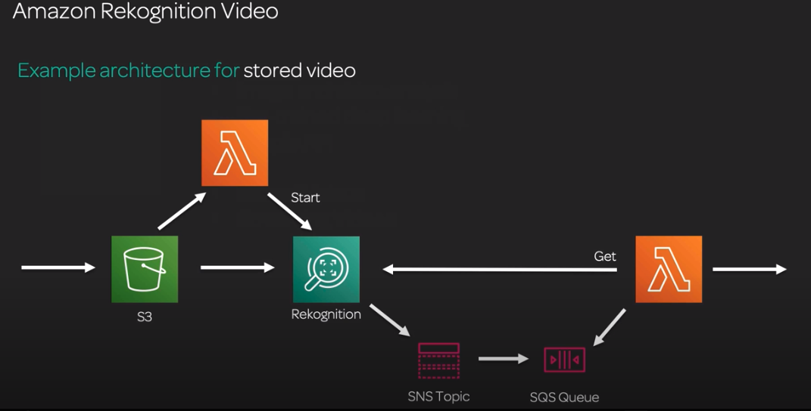
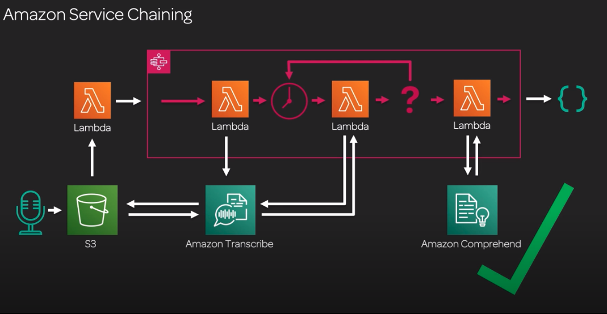

# AWS Application Services AI/ML

## Rekognition
Fully managed service, serving a pre-trained deep learning model for image and video analysis.
* Common to use AWS Lambda to connect to the services
* **Images**: image moderation (eg. porn filter), facial analysis (find faces, gender), celebrity, comparison, text in image
* **Videos**:  Detect people of interest, create metadata catalog for stock videos, detect offensive content

### Video architecture
* Object is uploaded to S3
* Triggers a lambda function to call the Rekognition service
* Rekognition queries S3 to get the video and starts analysing
* When done, will send a message through SNS topic that it's done
* SNS will put that through an SQS 
* Another Lambda function triggered when the SNS topic is triggered, get metadata from SQS about the video results, and finally go to Rekognition and get the results

## Amazon Polly 
Text to speech service (TTS). Fully managed pre-trained deep learning. Supports multiple languages, male or female voices and custom lexicons for industry specific language.  
* **Speech Synthesis Markup Language** (SSML): Be more specific about the inflections (eg. whispering)
* **Use cases**: Read out loud web content, provide generated announcements, automated voice response solutions

## Amazon Transcribe
Speech to text. Automatic Speech Recognition (ASR). Pre-trained deep learning models, supports different languages and custom vocabulary

## Amazon Translate
Text translation, fully managed pre-trained deep learning models. Batch process, real-time, custom terminology.
* **Use cases**: Enhance online customer chat application to translate conversations in real time, batch translate documents, create news publish solutions to multiple languages
* Knows more languages than other services, such as Comprehend

## Amazon Comprehend
Natural language Processing (NLP) system. Give it text, get back analysis of the text. 
* **Key Offerings**: Key-phrase extraction, sentiment, syntax, entity recognition, language detection, topic modelling, multiple languages. 
* Medical named entity and relationship extraction
* Customise: entities and classification
* Use case: Customer sentiment analysis, label unstructured data, topics from transcribed audio

## Amazon Lex
Chatbots, Alexa. 

## Service chaining w/ AWS Step Functions
Orchestrate multiple Lambda functions

### Example architecture with Step functions
* Audio is saved into an **S3 Bucket**
* **Lambda-1** is triggered, that simply calls the **Step Function** (red box)
* Inside the **Step Function**, is a **Lambda** that calls both **Transcribe** & a **Wait function** (clock icon)
* **Transcribe** then calls **S3** to get back the audio file and starts processing it. This might take a while 
* The middle **Lambda-2** has 1 role, to query **Transcribe** for the job status (eg. every 10seconds) and pass the status and data into a **Decision Point** (question mark)
* If the status isn't finished the **Decision Point** invokes the **Wait Function** again, which restarts the check status process
* If the status is finished, invoke the last **Lambda-3** that invokes **Comprehend**
* **Comprehend** analyses the data, sends the results back to **Lambda-3** that passes it on to another service

