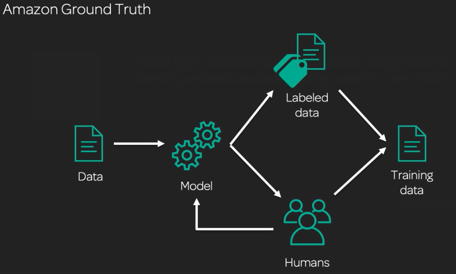

# Sagemaker Build
Have a goal in mind before starting any machine learning task. **Define your problem first**
## Data Preprocessing
Can take as long as you want, making it very important that we define our problem upfront. Primarily use SageMaker notebooks
* Visualise
* Explore
* Feature engineering: Can be done in Jupyter if its small, else EMR
* Synthesize data
* Convert data
* Change structure (join)
* Split data

## Ground truth
> _"Build highly accurate training data using machine learning and reduce data labeling costs by upt to 70%"_

Uses active learning to help label the most ambiguous data and outsources that to Mechanical Turk

## SageMaker Algorithms
* **AWS built-in** algorithms
* **AWS Marketplace**: Crowd sourced, sometimes pre-built for transfer learning
* **Custom**: Make your own

Algorithm Types
* **BlazingText**: Word2vec (Amazon Comprehend)
* **Image classification**: CNN (Amazon Rekognition)
* **K-means**: Based off web-scale k-means clustering
* LDA
* PCA
* XGBoost