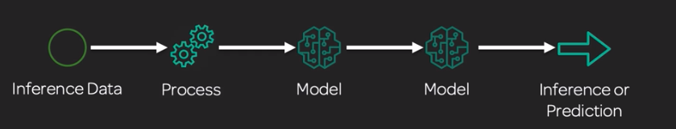
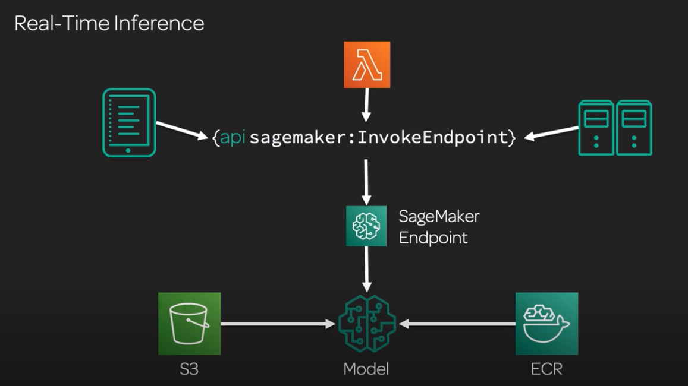
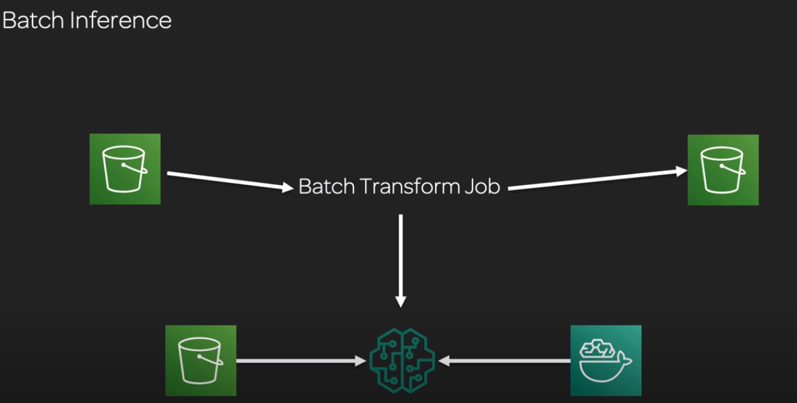

# Sagemaker Deploy
**Inference pipelines**: Unseen data goes into model which makes a prediction
* But often we have models feeing into models
* Unseen data comes in, is pre-processed, the fed into PCA, output of PCA goes into XGBoost, which makes the final prediction  

## Real-time  inference
* Model gets data from S3, model built in ECR and accessed via SageMaker endpoint
* SageMaker endpoint. Not accessible outside of AWS, only for internal usage. Have to be authenticated. Called via API

## Batch inference
* Model gets data from S3, model built in ECR and create a Batch Transform job
* Batch job takes a large volume of data, pushes it into the model, makes inferences and stores the output somewhere 

