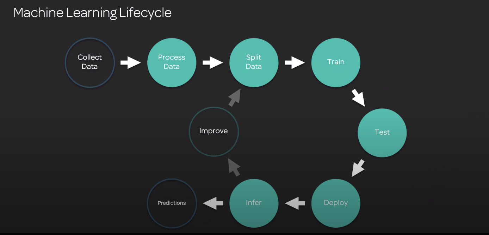

# Machine learning concepts
## Machine learning life-cycle

## Supervised, unsupervised & reinforcement learning

## Optimization
Gradient decent

## Regularization
> Need to understand, not calculate
Mathematical process which will try and desensitize your model to a particular dimension. 
* L1 -- Lasso
* L2 -- Ridge regression
* Use when model is overfit

 ## Hyperparameters
 External parameters set BEFORE model is trained, such as learning rate, epochs and batch size
* **Learning rate**: Size of step taken in gradient decent (between 0 and 1)
* **Batch Size**: Number of samples used to train. One, some or all of your data (commonly 32/64/128). Could be based on infrastructure. 
* **Epochs**: Number of times your algorithm will process all the training data. Contains one or more batches. Very high numbers, 10-1000  

## Cross-validation

