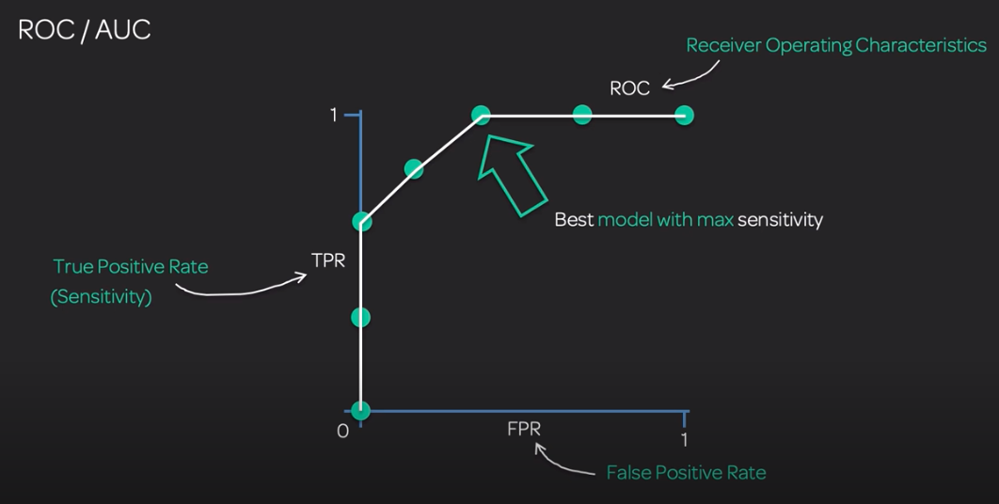

# 5. Model Performance and Optimization
Confusion matrix

**Sensitivity** (Recall / True Positive Rate): Number of positives out of all positives 
* TP / (TP + FN)
* When you want to avoid **false negatives** 
* % of people with a disease that are identified as having the disease
* _"Recall all the **positives** in the dataset, how many did you get right?"_

**Specificity** (True Negative rate): Correct  positives out of the predicted positive results
* TN / (TN + FP)
* When you want to avoid **false positives** 
*  % of people without a disease that are identified as not having the disease
* _"Recall all the **negatives** in the dataset, how many did you get right?"_

**Precision**:
* TP / (TP + FP) 
* How accurate are you? 
* _Out of all the things you said were positive, how many actually were?_

**Accuracy**: Proportion of all predictions correctly identified 
* (TP + TN) / Total
* Correct / total = Accuracy
* How correct overall am I?

**ROC / AUC**: Visualise the balance of sensitivity (TPR) and specificity (FPR) of a  binary classifier when using different cutoff points for the classification 

https://www.youtube.com/watch?v=4jRBRDbJemM

**GINI Impurity**: Measure of impurity when evaluating which feature to use in splitting decision trees. The feature with the lowest GINI impurity score gets chosen as the root node.

**F1 Score**: Combination of Recall and precision, takes more into account FP and FN than accuracy. 
* 2 * ( Recall * Precision) / ( Recall + Precision )

