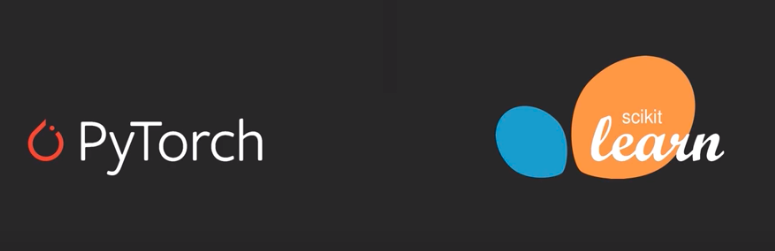
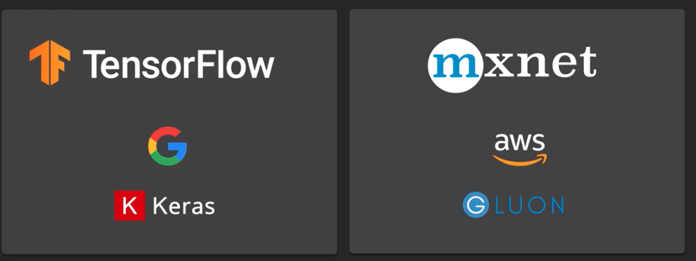

# Machine learning tools and frameworks

Machine learning & Deep learning 



## Tensorflow
Define graph up front and then run it
* Tensor: Multidimensional array that can hold data
* Graph: Flow of data
```python
import tensorflow as tf
```

## Pytorch
Creating the graph as you go along. Can be more dynamic than TF.
```python 
import pytorch
```

## MXNet
Framework of AWS Sagemaker, similar to pytorch you create graphs on the fly.
```python 
import mxnet as mx
from mxnet import nd #ndarray
from mxnet import autograd #autogradient
```
## From Linux academy:
### TensorFlow

TensorFlow (backed by Google) is an end-to-end, open source platform for machine learning. It has a comprehensive, flexible ecosystem of tools, libraries, and community resources. This lets researchers push the state-of-the-art in ML and developers easily build and deploy ML-powered applications.

_(Source: https://www.tensorflow.org/)_

### Keras

Keras is a high-level neural networks API, written in Python and capable of running on top of TensorFlow, CNTK, or Theano. It was developed with a focus on enabling fast experimentation. Being able to go from idea to result with the least possible delay is key to doing good research.

_(Source: https://keras.io/)_

__Or, to put it another way:__

TensorFlow is a complex tool. Keras has been built ontop of TensorFlow as a more user-friendly interface. It helps us rapidly prototype models, and we use it in this lab.