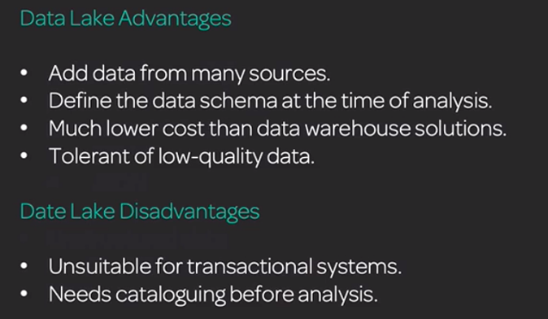
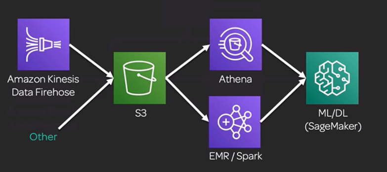
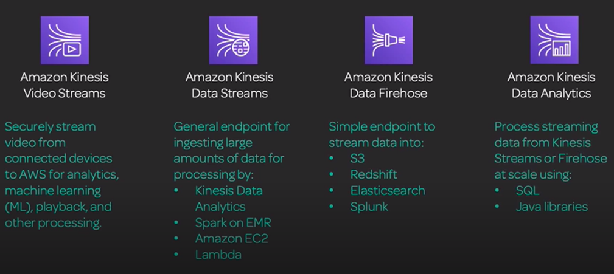
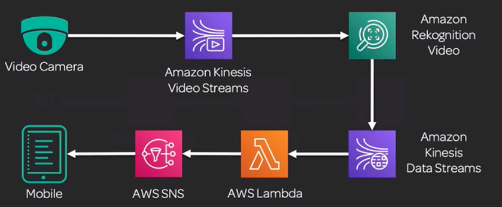

# AWS Services

## S3 datalakes 
Collection of structured and unstructured files stored in S3

### Simple architecture 
**Kinesis** (or other) captures data > **S3** stores it > **Glue** catalogs it >  **Athena** (simple) and **EMR** (large/complex) queries it > **Sagemaker** models it

## Glue
Creates catalogues of data, doesn't store any data. Gluing together multiple schemas, databases, sources and load it into a final destination. 
* Some limited behind the scenes machine learning capabilities to assist, such as detecting duplicate users (work/personal email etc)
* Crawler

## Athena 
"SQL Interface for S3". 
* Can save outputs of queries back to S3

## Quicksight
AWS Business Intelligence (BI) tool. Should be enough to know from high level. 
* Create dashboards, email reports and embedded reports
* Analyse your initial training data

## Kinesis - mentioned a lot
Ingest large amounts of data from different streams. IoT devices is a common use-case. 
* **Video stream**: Can store video for up to 7 days and playback
* **Data stream**: Catch all for processing
* **Firehose**: Ingest data for analysis
* **Data Analytics**: Analyse data on the fly using SQL queries 

### Example:
Video streaming and facial recognition on the fly that sends out notifications if a particular person is spotted in a crowd.  

## EMR w/ SPARK 
**Elastic Map Reduce**: Hosting Massively parallel compute, works very well in cloud. Integrates well with S3. 
* Task nodes can be ripped out without failing the whole cluster == Spot instances

**Spark**: Fast analytics engine for massively parallel compute tasks. 
* Can run inside EMR & Sagemaker

## EC2 for ML 
**EC2 instances for ML**:
* Compute optimised 
* Accelerated Computing (GPU)
* Sagemaker specific: _ml.*_

**Conda based deep learning AMIs**: TensorFlow, keras, MXNET, gluon, pytorch, ...

**Service limits** on by default to protect you from accidentally spinning up a large host of very expensive instance for terabytes of data. 
* Can be lifted, but have to be requested (takes days)

## AWS Machine Learning (ML) - Service, depreciated
The MVP ML service, but no longer exists. Comes up as a red-herring, never the right answer