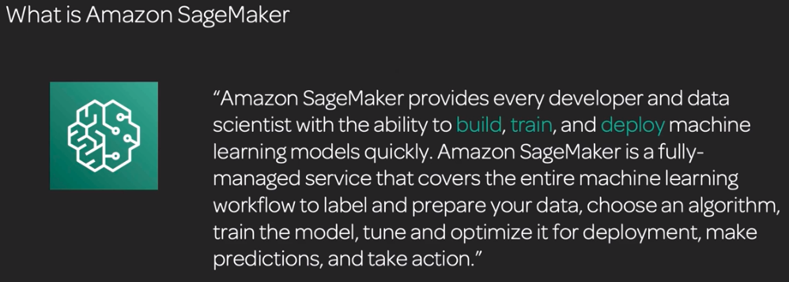
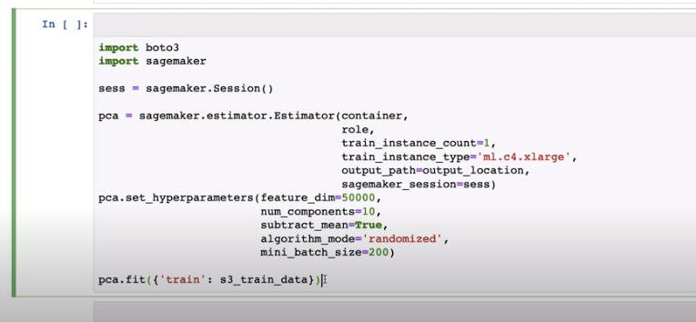

# Sagemaker
Note really like any other service. Could spend all your time in there without having to do anything else. Fully managed service from start to finish. End-to-end

## Three stages
**Build**: Preprocess, ground truth, notebooks

**Train**: Built-in algorithms, hyperparameter tuning, notebooks, infrastructure

**Deploy**: Realtime, batch, notebooks, infrastructure, Neo

## Control
Console, SDK, Jupyter

**Sagemaker API**: Can be called to provision and run services

**Sagemaker Python SDK**: Control and provision Sagemaker instances right through Jupyter Notebooks

## Sagemaker notebooks
Instance type doesn't have to be very large in order for you to do intense machine learning. 
*  Instance type can be used as a control panel for the notebook, and the notebook calls services that provision more intense infrastructure to run the code
* Lots of example notebooks to browse
* Starting notebooks takes a while as it's provisioning all the infrastructure in the backend
* Clicking `Open Jupyter | Open Jupyterlab` redirects you to the endpoint for your instance with a pre-signed url.
    * Can't share the link with others

